**Vehicle Detection Project**

The goals / steps of this project are the following:

* Perform a Histogram of Oriented Gradients (HOG) feature extraction on a labeled training set of images and train a classifier Linear SVM classifier
* Apply a color transform and append binned color features, as well as histograms of color, to HOG feature vector.
* For those first two steps normalize extracted features and randomize a selection for training and testing.
* Implement a sliding-window technique and use trained classifier to search for vehicles in images.
* Run the pipeline on a video stream (start with the test_video.mp4 and later implement on full project_video.mp4) and create a heat map of recurring detections frame by frame to reject outliers and follow detected vehicles.
* Estimate a bounding box for vehicles detected.

### Features extraction

#### 1. Extract features from the training images.

I started by reading in all the `vehicle` and `non-vehicle` images. This can be found in the code cell titled 'Data Exploration'. Some examples of the `car` and `non-car` classes can be seen under title "Visualizing some images in dataset" in my project file and can also be seen below:

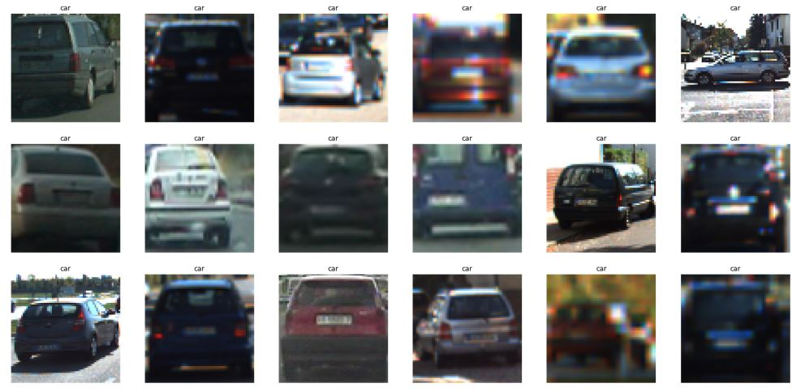
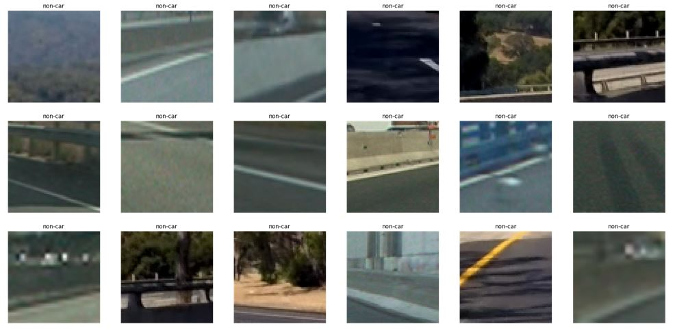

Once I explored the data that I will use in this project, the next step is to extract features from images. In this project, I used a combination of Histogram of Oriented Gradients (HOG) features, Histogram of color features and Spatial binning of color features. I started with using only HOG features for training my classifier but combining with other features did result in better results.

#### Histogram of Oriented Gradients (HOG): 

The code for this step can be found under title "Histogram of Oriented Gradients (HOG)" in my project file. 

I have used scikit-image package that has a built in function to extract Histogram of Oriented Gradient features. The documentation for this function can be found [here](http://scikit-image.org/docs/dev/api/skimage.feature.html?highlight=feature%20hog#skimage.feature.hog) and a brief explanation of the algorithm and tutorial can be found [here](http://scikit-image.org/docs/dev/auto_examples/features_detection/plot_hog.html).Steps in this algorithm can be summarised as:

1. (optional) global image normalisation  
2. computing the gradient image in x and y
3. computing gradient histograms
4. normalising across blocks
5. flattening into a feature vector

I have explored different color spaces and different `skimage.hog()` parameters (`orientations`, `pixels_per_cell`, and `cells_per_block`).  I grabbed random images from each of the two classes and displayed them to get a feel for what the `skimage.hog()` output looks like in different color spaces. The code and examples for this visualization can be seen under title 'Visualizing HOG on an image from dataset'. Below are the examples using different color spaces and HOG parameters of `orientations=11`, `pixels_per_cell=(16, 16)` and `cells_per_block=(2, 2)`:

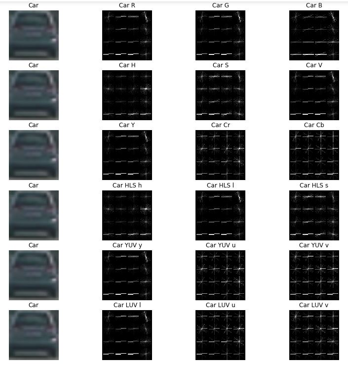
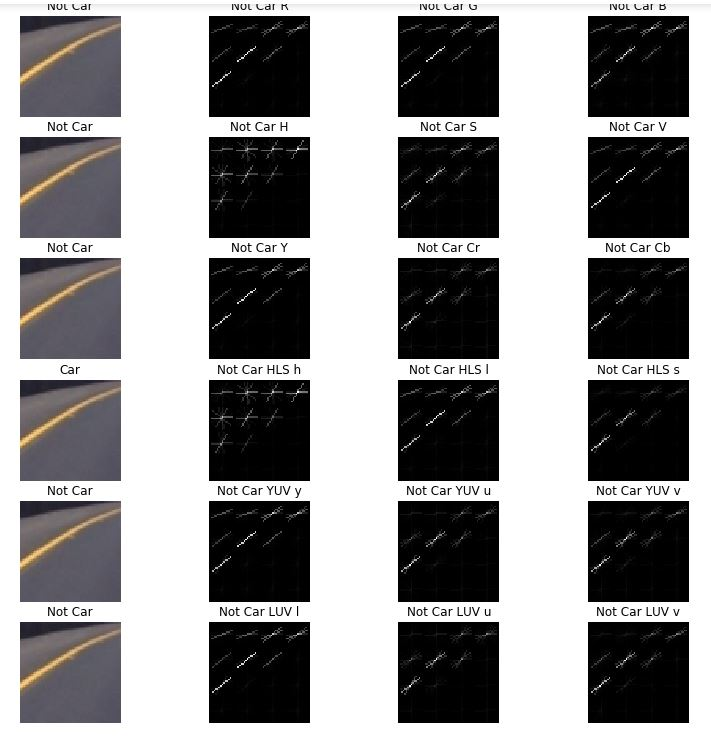

#### Histogram of Color:

The code for this step can be found under title "Histogram of Color" in my project file. 

Histogram of color in an image is useful in differentiating objects but this could wrongly classfy a non-car image as a car image when we solely rely on distribution of color values. Due to this reason I combined these features with other features to help differentiate the objects in an image. One example of the `car` and `non-car` class can be seen under title "Visualizing Hisogram of color on an image from dataset" in my project file and can also be seen below: 

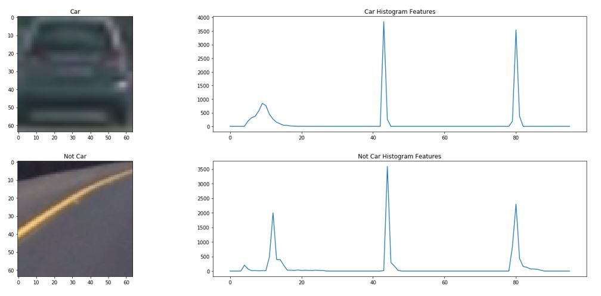

#### Spatial Binning of color:

The code for this step can be found under title "Spatial Binning of color" in my project file. 

As seen in Histogram of color example above, template matching is not a particularly robust method for finding vehicles unless you know exactly what your target object looks like. However, raw pixel values are still quite useful to include in your feature vector in searching for cars.

While it could be cumbersome to include three color channels of a full resolution image, you can perform spatial binning on an image and still retain enough information to help in finding vehicles. In order to reduce the number of elements in feature vector I have used the size (16,16) and I could still retain enough information from the image. One example of the `car` and `non-car` class can be seen under title "Visualize spatial binning on an image from dataset" in my project file and can also be seen below: 

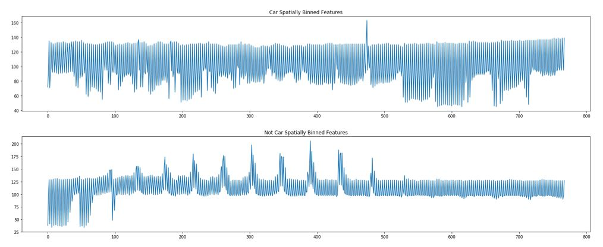

#### 2. Explain how you settled on your final choice of HOG parameters.

Parameter tuning was the most time taking part of this project which took almost 30 hours or may be more. I tried various combinations of parameters with RGB, HSV, YCrCb, HLS, YUV, LUV color spaces and HOG parameters with `orientations` values of 6,7,8,9,11,12,16 and `pixels_per_cell` values of (8, 8),(16, 16) and `cells_per_block` values of (2,2), (3,3), (4,4). I settled on my final choice of HOG parameters based upon the performance of the SVM classifier. I considered not only the accuracy with which the classifier made predictions on the test dataset, but also the speed at which the classifier is able to make predictions.

The final parameters chosen were: LUV colorspace, 11 orientations, 16 pixels per cell, 2 cells per block, and ALL channels of the colorspace. Choosing a value of 16 for pixels_per_cell parameter produced a roughly ten-fold increase in execution speed compared to using 8 with minimal cost to accuracy. 

#### 3. Describe how (and identify where in your code) you trained a classifier using your selected HOG features (and color features if you used them).

In the section titled "Preparing data for classifier" I extracted all the features from dataset by combining HOG features, Histogram of color features, Spatial binning of color which resulted in a feature vector of length 2052. I then defined labels for features, shuffled the data, split the data into training and test data and normalised features.

Once I have the data for the calssifier, in the section titled "Train a Classifier" I trained a linear SVM with C=0.01 and using all the features extracted as explained in above steps and was able to achieve a test accuracy of 98.67%. With default parameters for linear SVM my test accuracy was 98.42%.

### Sliding Window Search

#### 1. Describe how (and identify where in your code) you implemented a sliding window search.  How did you decide what scales to search and how much to overlap windows?

In the section titled "Hog Sub-sampling Window Search" I used the method find_cars from the lesson materials. This method combines HOG feature extraction with a sliding window search, but rather than perform feature extraction on each window individually (code for this can be found under title "Sliding window approach to find cars in an image") which can be time consuming, the HOG features are extracted for the entire image (or a selected portion of it) and then these full-image features are subsampled according to the size of the window and then fed to the classifier. The method performs the classifier prediction on the HOG features for each window region and returns a list of bounding boxes corresponding to the windows that generated a positive prediction.

Visualizing find_cars on test images using a single window size can be found under title 'Visualizing find_cars on test images' and also can be seen below:

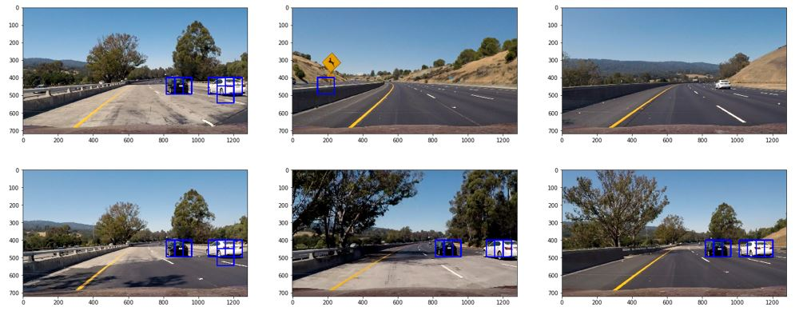

I have explored several configurations of window sizes and positions, with various overlaps in the X and Y directions. For my final implementation I have used search windows with scales of 1 for small, 1.5 and 2.0 for medium, and 3.0 for large. 

Bounding boxes drawn onto test images after applying sliding window using the above mentioned scales can be seen under title "Visualizing bounding boxes drawn onto test images" as well as below.

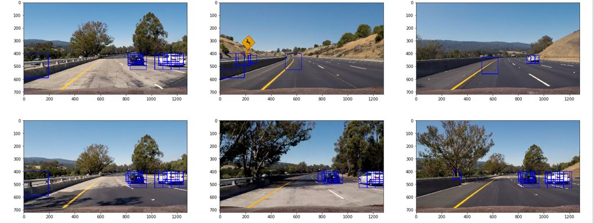

The final algorithm calls find_cars for each window scale and the bounding boxes returned from each method call are aggregated. An overlap of 75% in the Y direction produced more redundant true positive detections. Only an appropriate vertical range of the image is considered for each window size (e.g. smaller range for smaller scales) to reduce the chance for false positives in areas where cars at that scale are unlikely to appear. The final implementation considers enough window locations, which proved to be robust enough to reliably detect vehicles while maintaining a high speed of execution.

The image above shows the bounding boxes drawn on test images returned by find_cars in the final implementation. Notice that there are several positive predictions on each of the cars, and one positive prediction on a car in the oncoming lane in the first image.

As a true positive is usually accompanied by several positive detections, while false positives are usually accompanied by fewer detections, a combined heatmap and threshold is used to differentiate the two. The add_heat function increments the pixel value called as "heat" of an all-black image the size of the original image at the location of each detection rectangle. Areas encompassed by more overlapping rectangles are assigned higher levels of heat. The following images are the resulting heatmaps from the detections in the test images above.

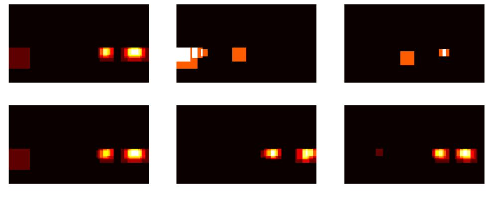

A threshold of 2 is applied to the heatmap, setting all pixels that don't exceed the threshold to zero. Examples can be seen under title "Visualizing heatmap after applying threshold on test images" as well as below:

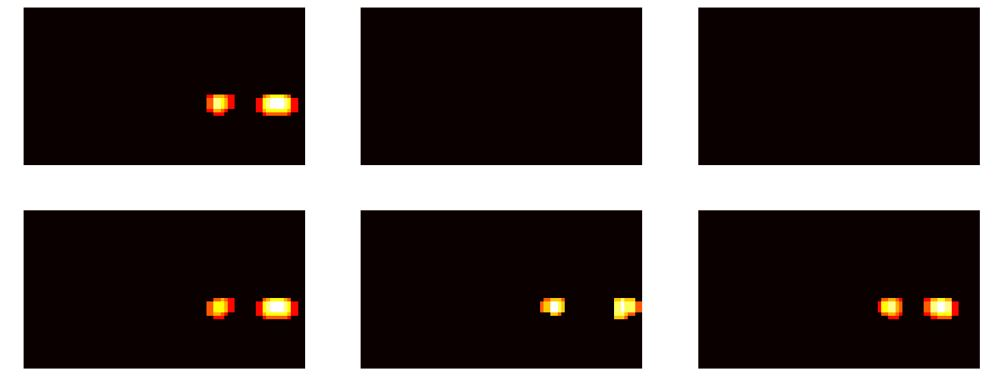

The scipy.ndimage.measurements.label() function collects spatially contiguous areas of the heatmap and assigns each a label. Examples can be seen under title "Visualizing labels on test images" as well as below:

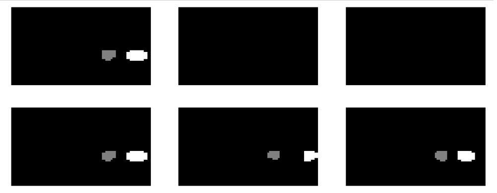

Based on the labels detected above, final detection area is set to the extremities of each identified label. Examples can be seen under title "Visualizing boxes drawn for labels" in the project file.

#### 2. Show some examples of test images to demonstrate how your pipeline is working.  What did you do to optimize the performance of your classifier?

Ultimately I searched on 4 scales using LUV 3-channel HOG features plus spatially binned color and histograms of color in the feature vector, which provided a nice result.  Here are some example images:

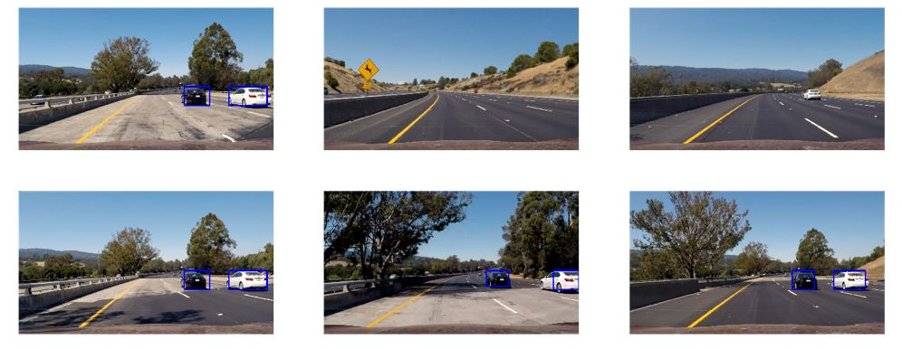

Below is the result after combining the vehicle detection pipeline with lane detecion pipleline. Detailed workflow for Advanced lane finding can be found [here](https://github.com/rakeshch/Advance-Lane-Finding).

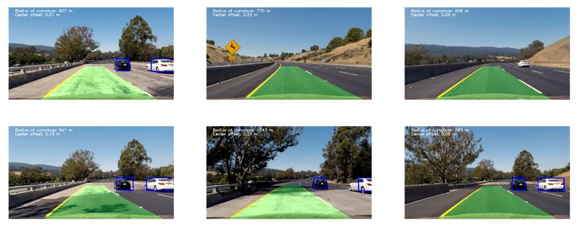

### Video Implementation

#### 1. Provide a link to your final video output.  Your pipeline should perform reasonably well on the entire project video (somewhat wobbly or unstable bounding boxes are ok as long as you are identifying the vehicles most of the time with minimal false positives.)

Here's a [link to my test file video result](./test_video_out.mp4)

Here's a [link to my project file video result](./project_video_out.mp4)

Here's a [link to my video result combined with Lane detection pipeline](./Lane_vehicle_detection_out.mp4)

#### 2. Describe how (and identify where in your code) you implemented some kind of filter for false positives and some method for combining overlapping bounding boxes.

The code for processing every frame of video is contained in the cell titled "Pipeline to detect cars in an image" and is identical to the code for processing a single image described above, with the exception of storing the detections (returned by find_cars) from the previous 10 frames of video using the prev_bboxes parameter from a class called Detector. 

### Discussion

#### 1. Briefly discuss any problems / issues you faced in your implementation of this project.  Where will your pipeline likely fail?  What could you do to make it more robust?

The major challenge of my project work was tuning the parameters which took a lot of my time. The pipeline is probably most likely to fail in cases where vehicles don't resemble those in the training dataset, but lighting and environmental conditions might also play a role. I believe it is possible to improve the classifier by additional data augmentation, classifier parameters tuning etc to eliminate further false positives in a frame.

Also, producing a very high accuracy classifier and maximizing window overlap might improve the per-frame accuracy to the point that integrating detections from previous frames is unnecessary (and oncoming traffic is correctly labeled), but it would require a massive processing power. I believe this could be offset with more intelligent tracking strategies like convolutional neural network or by determining vehicle location and speed to predict its location in subsequent frames.

